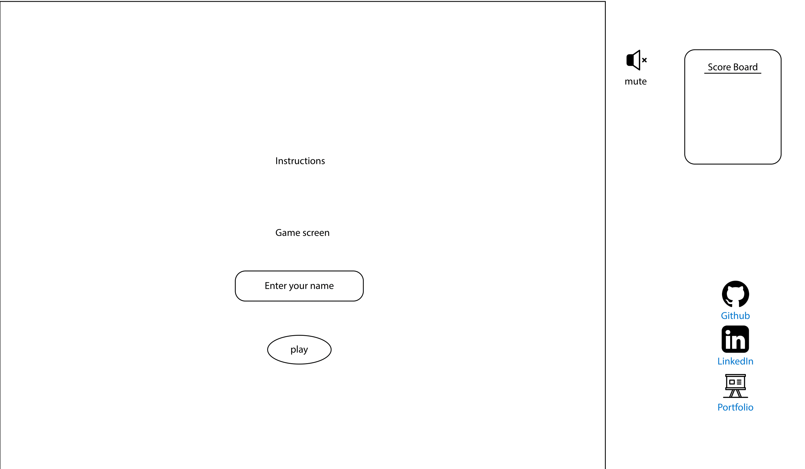

# Aggro Javascript Game

### Plan for process:

#### Phase 1:
-   Build framework of the game: page layout and structure

-   Construct canvas background and basic structure of player
#### Phase 2:
-   Get player to move in the direction of the mouse

-   Create balls for player to pick up
#### Phase 3:
-   Build logic for making the player grow in size

-   Add enemies that move in random directions

-   Add scoreboard

### WireFrame:

